# That Distributed Integration Engine (TDIE)

A .NET Core distributed process orchestration platform built as an experiment in scalable job processing across multiple nodes. TDIE explores a component-based architecture where business logic is packaged into reusable components that can be deployed and managed across a cluster of machines.

## Overview

TDIE is an experiment in distributed systems that explores horizontal scaling of job processing by distributing workloads across multiple nodes. The platform uses a component-based architecture where business logic is packaged into reusable components that can be deployed and managed across a cluster of machines.

### Key Capabilities

- **Distributed Process Orchestration**: Attempts to distribute and manage component instances across cluster nodes
- **Dynamic Component Loading**: Supports hot-deployment of components without system restarts
- **Cluster Management**: Basic node discovery, health monitoring, and workload balancing
- **Message-Driven Architecture**: Simple publish/subscribe messaging between components
- **Package Management**: Basic deployment and versioning of component packages
- **RESTful APIs**: REST APIs for cluster and node management
- **Extensible Framework**: Plugin architecture for custom components and message publishers

## Architecture

### Distributed Cluster Architecture Diagram

The following diagram shows how TDIE operates in a 3-node cluster environment, demonstrating the distributed orchestration, component hosting, and inter-node communication patterns:

```mermaid
graph TB
    subgraph "TDIE Distributed Cluster Architecture"
        subgraph "Master Node (Node 1 - tdie-node-1)"
            subgraph "Node Manager Process"
                NM[NodeManagerComponent<br/>IComponent Implementation]
                CM[ClusterManager<br/>Node Distribution Logic]
                NS[NodeSynchronizer<br/>Package Synchronization]
                DLF[DistributedLockFactory<br/>SQL Server Locks]
                MAPI[Master Web API<br/>:7777/api/master]
            end
            
            subgraph "Component Host Instances"
                CH1A[Component Host A<br/>:5000]
                CH1B[Component Host B<br/>:5001]
                CH1C[Component Host C<br/>:5002]
            end
            
            subgraph "Node API"
                N1API[Node API<br/>:5100/api/node]
                PM1[Package Manager<br/>LiteDB Storage]
                PROC1[Process Manager<br/>Local Process Control]
            end
        end

        subgraph "Worker Node 2 (tdie-node-2)"
            subgraph "Component Host Instances"
                CH2A[Component Host A<br/>:5000]
                CH2B[Component Host B<br/>:5001]
                CH2C[Component Host C<br/>:5002]
            end
            
            subgraph "Node API"
                N2API[Node API<br/>:5100/api/node]
                PM2[Package Manager<br/>LiteDB Storage]
                PROC2[Process Manager<br/>Local Process Control]
            end
        end

        subgraph "Worker Node 3 (tdie-node-3)"
            subgraph "Component Host Instances"
                CH3A[Component Host A<br/>:5000]
                CH3B[Component Host B<br/>:5001]
                CH3C[Component Host C<br/>:5002]
            end
            
            subgraph "Node API"
                N3API[Node API<br/>:5100/api/node]
                PM3[Package Manager<br/>LiteDB Storage]
                PROC3[Process Manager<br/>Local Process Control]
            end
        end

        subgraph "Components Running in Component Hosts"
            subgraph "Component Types (IComponent Implementations)"
                FW[File Watcher<br/>Monitor Directories]
                QS[Quartz Scheduler<br/>Cron Jobs]
                WA[Web API<br/>REST Endpoints]
                DR[Database Replication<br/>Data Sync]
                CUSTOM[Custom Components<br/>Business Logic]
            end
        end

        subgraph "Shared Infrastructure"
            subgraph "SQL Server Database"
                LOCKS[Distributed Locks Table<br/>Medallion.Threading.Sql]
                META[Metadata Storage<br/>Component Configurations]
            end
            
            subgraph "Package Repository"
                PKG1[componentHost.zip]
                PKG2[fileWatcher.zip]
                PKG3[quartzScheduler.zip]
                PKG4[webApiComponent.zip]
                PKG5[customComponent.zip]
            end
        end
    end

    %% Connections - Cluster Management
    NM -->|Timer: 50s Sync| CM
    CM -->|Distributed Operations| DLF
    CM -->|Package Deployment| NS
    NS -->|HTTP Requests| N1API
    NS -->|HTTP Requests| N2API
    NS -->|HTTP Requests| N3API

    %% Connections - Component Host Management
    CM -->|Start/Stop/Configure| CH1A
    CM -->|Start/Stop/Configure| CH1B
    CM -->|Start/Stop/Configure| CH1C
    CM -->|Start/Stop/Configure| CH2A
    CM -->|Start/Stop/Configure| CH2B
    CM -->|Start/Stop/Configure| CH2C
    CM -->|Start/Stop/Configure| CH3A
    CM -->|Start/Stop/Configure| CH3B
    CM -->|Start/Stop/Configure| CH3C

    %% Connections - Node API to Local Services
    N1API -->|Process Control| PROC1
    N1API -->|Package Operations| PM1
    N2API -->|Process Control| PROC2
    N2API -->|Package Operations| PM2
    N3API -->|Process Control| PROC3
    N3API -->|Package Operations| PM3

    %% Connections - Component Hosting
    CH1A -.->|Hosts| FW
    CH1B -.->|Hosts| QS
    CH1C -.->|Hosts| WA
    CH2A -.->|Hosts| DR
    CH2B -.->|Hosts| CUSTOM
    CH2C -.->|Hosts| FW
    CH3A -.->|Hosts| QS
    CH3B -.->|Hosts| WA
    CH3C -.->|Hosts| DR

    %% Connections - Database Access
    DLF -->|Acquire/Release Locks| LOCKS
    CM -->|Read Configurations| META
    NS -->|Read Configurations| META

    %% Connections - Package Repository
    NS -->|Deploy Packages| PKG1
    NS -->|Deploy Packages| PKG2
    NS -->|Deploy Packages| PKG3
    NS -->|Deploy Packages| PKG4
    NS -->|Deploy Packages| PKG5

    %% Process Management
    PROC1 -->|Launch/Kill| CH1A
    PROC1 -->|Launch/Kill| CH1B
    PROC1 -->|Launch/Kill| CH1C
    PROC2 -->|Launch/Kill| CH2A
    PROC2 -->|Launch/Kill| CH2B
    PROC2 -->|Launch/Kill| CH2C
    PROC3 -->|Launch/Kill| CH3A
    PROC3 -->|Launch/Kill| CH3B
    PROC3 -->|Launch/Kill| CH3C

    %% External API Access
    EXT[External Clients<br/>REST API Calls] -->|Cluster Management| MAPI
    EXT -->|Direct Node Access| N1API
    EXT -->|Direct Node Access| N2API
    EXT -->|Direct Node Access| N3API

    classDef masterNode fill:#e1f5fe,stroke:#0277bd,stroke-width:2px
    classDef workerNode fill:#f3e5f5,stroke:#7b1fa2,stroke-width:2px
    classDef componentHost fill:#fff3e0,stroke:#f57c00,stroke-width:2px
    classDef component fill:#e8f5e8,stroke:#388e3c,stroke-width:2px
    classDef infrastructure fill:#fce4ec,stroke:#c2185b,stroke-width:2px
    classDef api fill:#e3f2fd,stroke:#1976d2,stroke-width:2px

    class NM,CM,NS,DLF,MAPI masterNode
    class N2API,PM2,PROC2,N3API,PM3,PROC3 workerNode
    class CH1A,CH1B,CH1C,CH2A,CH2B,CH2C,CH3A,CH3B,CH3C componentHost
    class FW,QS,WA,DR,CUSTOM component
    class LOCKS,META,PKG1,PKG2,PKG3,PKG4,PKG5 infrastructure
    class N1API,PM1,PROC1 api
```



### Architecture Flow Description

#### **1. Cluster Orchestration (Master Node)**
- **NodeManagerComponent**: Runs as an IComponent within a Component Host, demonstrating the experimental extensible architecture
- **Timer-Based Synchronization**: Every 50 seconds, triggers cluster-wide synchronization operations
- **ClusterManager**: Coordinates component distribution, node expansion/shrinkage, and instance lifecycle management
- **Distributed Locking**: Uses SQL Server-based locks via Medallion.Threading.Sql for cluster-wide coordination

#### **2. Component Distribution Pattern**
```
Master Node Decision → Distributed Lock Acquisition → Package Synchronization → 
Component Host Provisioning → Component Instantiation → Health Monitoring
```

#### **3. Node Communication**
- **RESTful APIs**: All inter-node communication via HTTP/HTTPS REST APIs
- **Node API Endpoints**: Each node exposes standardized `/api/node` endpoints for:
  - Process management (`/processes`)
  - Package management (`/packages`) 
  - Health monitoring (`/stats`)

#### **4. Component Host Isolation**
- **Process Isolation**: Each component runs in its own Component Host process
- **Dynamic Port Allocation**: Ports assigned dynamically (starting from 5000)
- **Independent Lifecycles**: Components can be started/stopped/updated independently
- **Configuration-Driven**: All components use same IComponent interface regardless of complexity

#### **5. Package Management Flow**
```
Package Upload → Validation → Distribution to Nodes → Local Storage → 
Component Host Provisioning → Assembly Loading → Component Instantiation
```

#### **6. Distributed Operations**
- **Cluster Expansion**: New nodes automatically receive all required packages and component instances
- **Cluster Shrinkage**: Components gracefully shut down before node removal
- **Load Balancing**: Components distributed across available nodes based on capacity
- **Fault Tolerance**: Failed nodes detected and workloads redistributed automatically

#### **7. Extensible Architecture Experiment**
- **Uniform Interface**: File Watchers, Schedulers, Web APIs, and the Node Manager itself all implement IComponent
- **Same Lifecycle**: All components use StartAsync/StopAsync pattern
- **Configuration Consistency**: All components configured via key-value pairs
- **Deployment Uniformity**: All components packaged and deployed identically

This architecture demonstrates an experimental approach where complex distributed orchestration is built from the same foundational abstractions as simple components, exploring scalability through a unified component model.

### Core Components

#### 1. **Node Manager** ([`TDIE.Components.NodeManager`](src/TDIE.Components.NodeManager/))
The Node Manager acts as the central orchestrator for the distributed cluster. It coordinates cluster-wide operations and maintains the overall health of the distributed system.

**Responsibilities:**
- **Cluster Synchronization**: Monitors and synchronizes the state of all nodes in the cluster
- **Component Distribution**: Distributes component instances across available nodes
- **Node Health Monitoring**: Tracks the health and performance of individual nodes
- **Package Deployment**: Manages the deployment and versioning of component packages
- **Distributed Locking**: Coordinates access to shared resources using distributed locks

**Architecture Components:**
- **Cluster Manager**: Handles node addition, removal, and load distribution
- **Node Synchronizer**: Ensures package versions and configurations are consistent across nodes
- **Distributed Lock Factory**: Provides cluster-wide locking mechanisms using SQL Server-based distributed locks
- **Component Instance Manager**: Tracks and manages component instances across the cluster

**Operational Flow:**
1. **Cluster Discovery**: Reads cluster configuration and discovers available nodes
2. **Node Synchronization**: Ensures all nodes have the required packages and configurations
3. **Instance Distribution**: Distributes component instances based on configured rules
4. **Health Monitoring**: Monitors node health and redistributes workloads when failures occur
5. **Package Synchronization**: Deploys new package versions across the cluster

**REST API Endpoints:**
- `GET /api/master` - Cluster management endpoints (implementation in progress)

**Configuration Management:**
The Node Manager uses JSON configuration files to define cluster topology, node specifications, and component deployment rules. The cluster configuration is defined in `clusterSettings.json`:

```json
{
  "nodePackages": [
    {
      "name": "ComponentHostProcess",
      "version": "1.0.0",
      "packagePath": "\\\\node-share\\repos\\Integration Platform\\TDIE.ComponentHost.WebApi\\TDIE.ComponentHost.WebApi\\bin\\Release\\netcoreapp2.2\\componentHost.zip"
    }
  ],
  "componnetHostPackageName": "componentHostProcess",
  "nodeServers": [
    {
      "networkName": "tdie-node-1",
      "networkIp": "10.0.10.21",
      "nodeApiUri": "https://n1.tdie.skynet.home"
    },
    {
      "networkName": "tdie-node-2",
      "networkIp": "10.0.10.22",
      "nodeApiUri": "https://n2.tdie.skynet.home"
    },
    {
      "networkName": "tdie-node-3",
      "networkIp": "10.0.10.23",
      "nodeApiUri": "https://n3.tdie.skynet.home"
    }
  ]
}
```

**Configuration Properties:**
- **`nodePackages`**: Array of packages that need to be deployed to cluster nodes
  - `name`: Package identifier used for reference
  - `version`: Package version for tracking updates
  - `packagePath`: File system path or network path to the package ZIP file
- **`componnetHostPackageName`**: Name of the Component Host package that manages component instances
- **`nodeServers`**: Array of nodes available in the cluster
  - `networkName`: Unique identifier for the node
  - `networkIp`: IP address of the node for network communication
  - `nodeApiUri`: Base URI for the Node API endpoint

#### 2. **Component Host** ([`TDIE.ComponentHost`](src/TDIE.ComponentHost/))
The Component Host is a lightweight runtime environment that serves as a building block for component execution within the distributed system, providing process isolation, lifecycle management, and dynamic service composition.

**Responsibilities:**
- **Dynamic Component Loading**: Loads and instantiates components from assemblies at runtime
- **Isolated Runtime Environment**: Provides process isolation for component instances
- **Lifecycle Orchestration**: Manages the complete component lifecycle from configuration through startup to shutdown
- **Dependency Injection Container**: Creates and manages a DI container with automatic service registration
- **Configuration-Driven Assembly Loading**: Loads components and message publishers based on assembly paths and class names
- **State Management**: Tracks and manages component and host states with error handling

**Architecture Components:**
*ComponentHostBackgroundService*: The core orchestration engine that manages component instances
- **Service Provider Management**: Creates isolated `IServiceProvider` instances with component-specific service registrations
- **Assembly Loading**: Dynamically loads assemblies using `GetTypeFromAssembly()` for both components and message publishers
- **Configuration Validation**: Validates assembly paths, class names, and component compatibility before instantiation
- **Error Handling**: Implements error handling with state tracking and rollback capabilities

*Dependency Injection Pipeline*:
```csharp
_serviceProvider = new ServiceCollection()
    .AddSingleton(_loggerFactory)
    .AddLogging()
    .AddOptions()
    .AddSingleton(_componentSettings)
    .AddSingleton(_messagePublisherSettings)
    .AddSingleton<IObjectMapperService, ObjectMapperService>()
    .AddSingleton(typeof(IMessagePublisher), MessagePublisherType)
    .AddSingleton(typeof(IComponent), ComponentType)
    .BuildServiceProvider();
```

*Dynamic Type Resolution*:
- Components are loaded using `ComponentType = GetTypeFromAssembly(assemblyPath, fullyQualifiedClassName)`
- Message publishers are optionally loaded based on component requirements
- Type validation ensures components implement required interfaces (`IComponent`, `IMessagePublisher`)

**Component Host State Machine:**
The Component Host implements a state machine with the following states:
- **`AwaitingConfiguration`**: Initial state waiting for component and message publisher configurations
- **`Configured`**: Assembly loading completed, services configured, ready to start
- **`Started`**: All services running, component and message publisher active
- **`Stopping`**: Graceful shutdown in progress, stopping services in proper order
- **`Stopped`**: All services stopped, ready for reconfiguration or disposal
- **`Errored`**: Error state due to configuration, loading, or runtime failures
- **`Destroyed`**: Resources cleaned up, host ready for termination

**Lifecycle Management:**
*Configuration Phase*:
1. **Assembly Validation**: Validates assembly paths and component types
2. **Message Publisher Resolution**: Determines if component requires message publisher
3. **Settings Injection**: Creates component and message publisher settings from configuration
4. **Service Registration**: Registers all services in dependency injection container
5. **Instance Creation**: Creates component and message publisher instances

*Startup Sequence*:
1. **Message Publisher First**: Starts message publisher before component to ensure immediate publishing capability
2. **Component Activation**: Starts component with cancellation token for graceful shutdown support
3. **State Tracking**: Monitors component and message publisher states independently
4. **Error Recovery**: Implements rollback mechanisms for failed startup attempts

*Shutdown Orchestration*:
1. **Component First**: Stops component first to complete any pending work
2. **Message Publisher Last**: Stops message publisher after component to allow final message publishing
3. **Resource Cleanup**: Disposes all resources and clears service provider
4. **State Reset**: Resets host state for potential reconfiguration

**REST API Endpoints:**

*Component Host Management:*
- `GET /api/componentHost/configuration` - Get detailed host configuration and runtime state
- `POST /api/componentHost/shutdown` - Gracefully shutdown the component host with cleanup

*Package Management:*
- `POST /api/componentHost/packages` - Upload a new component package with validation
- `PUT /api/componentHost/packages` - Update an existing component package with version control
- `GET /api/componentHost/packages/configuration` - Get configuration for all installed packages
- `GET /api/componentHost/packages/{packageName}/configuration` - Get configuration for a specific package

*Service Management:*
- `PUT /api/componentHost/services/start` - Start all configured services (component and message publisher)
- `PUT /api/componentHost/services/stop` - Stop all running services with proper sequencing
- `PUT /api/componentHost/services/component/{packageName}/init` - Initialize a component service with configuration
- `PUT /api/componentHost/services/component/{packageName}/start` - Start a specific component service
- `PUT /api/componentHost/services/component/{packageName}/stop` - Stop a specific component service
- `PUT /api/componentHost/services/messagePublisher/{packageName}/init` - Initialize a message publisher service
- `PUT /api/componentHost/services/messagePublisher/{packageName}/start` - Start a message publisher service
- `PUT /api/componentHost/services/messagePublisher/{packageName}/stop` - Stop a message publisher service

**Extensible Architecture Pattern:**
The Component Host demonstrates an experimental extensible architecture where complex orchestration components like the Node Manager are implementations of the same `IComponent` interface. This creates a recursive architecture where:

*Uniform Interface Implementation*:
```csharp
public sealed class NodeManagerComponent : IComponent
{
    public IComponentSettings Settings { get; }
    public string Name => Settings.Name;
    public Guid InstanceId { get; } = Guid.NewGuid();
    public ObjectState State { get; }
    
    public async Task StartAsync(CancellationToken cancellationToken) { /* Cluster orchestration logic */ }
    public async Task StopAsync(CancellationToken cancellationToken) { /* Graceful cluster shutdown */ }
}
```

*Recursive Component Hosting*:
- The **Node Manager** runs as a component within a Component Host
- **File Watchers** run as components within Component Hosts
- **Schedulers** run as components within Component Hosts
- **Web APIs** run as components within Component Hosts
- **Custom Business Logic** runs as components within Component Hosts

*Configuration-Driven Deployment*:
Every component, regardless of complexity, uses the same deployment model:
```json
{
  "packageName": "NodeManager",
  "assemblyPath": "/path/to/TDIE.Components.NodeManager.dll",
  "fullyQualifiedClassName": "TDIE.Components.NodeManager.NodeManagerComponent",
  "settings": {
    "masterConfigurationFile": "clusterSettings.json",
    "syncInterval": "30000"
  }
}
```

*Unified Lifecycle Management*:
- All components use the same `IHostedService` lifecycle pattern
- Dependency injection works identically for simple and complex components
- Error handling, logging, and monitoring are consistent across all component types
- State management follows the same patterns regardless of component complexity

**Runtime Component Composition:**
The Component Host enables runtime composition:

*Dynamic Service Discovery*:
- Components can be loaded from any assembly path
- Message publishers are automatically detected and configured
- Dependencies are resolved through the unified DI container

*Hot Deployment*:
- New components can be deployed without system restart
- Existing components can be stopped, updated, and restarted
- Package versioning supports updates with rollback capabilities

*Isolation and Safety*:
- Each component instance runs in its own process
- Configuration errors are isolated to individual components
- Component failures don't affect other components or the broader system

**Features:**
*Message Publisher Integration*:
- Automatic detection of components that require message publishers
- Dynamic loading and configuration of publisher implementations
- Proper startup/shutdown sequencing for reliable message handling

*Configuration Flexibility*:
- Key-value pair configuration system works for any component type
- Assembly paths and class names are resolved at runtime
- Settings are injected automatically through dependency injection

*Monitoring*:
- Host state tracking with detailed error information
- Component and message publisher state monitoring
- Correlation IDs for distributed logging and troubleshooting

This extensible design means that adding new functionality to TDIE requires only:
1. Implementing the `IComponent` interface
2. Packaging the assembly with a manifest
3. Deploying through the standard package management system

The Node Manager orchestrating components across nodes is architecturally similar to a simple file watcher component - both are implementations of `IComponent` running within Component Hosts.

#### 3. **Node API** ([`TDIE.NodeApi`](src/TDIE.NodeApi/))
The Node API is a RESTful service that runs on each node in the cluster, acting as the local agent for the Node Manager. It provides an interface for managing the node's lifecycle, deploying component packages, and monitoring local processes.

**Responsibilities:**
- **Process Management**: Starting, stopping, and monitoring component host processes
- **Package Management**: Receiving, installing, and updating component packages
- **Health and Status Reporting**: Providing health status, performance metrics, and operational logs
- **Local Resource Access**: Exposing controlled access to local node resources

**REST API Endpoints:**

*Node Management:*
- `GET /api/node/stats` - Get node system statistics including environment info, process details, and network interfaces
- `GET /api/node/stats/processes` - Get statistics for all running processes on the node
- `GET /api/node/stats/processes/{packageName}` - Get process statistics filtered by package name

*Package Management:*
- `POST /api/node/packages` - Upload a new component package to the node
- `PUT /api/node/packages` - Update an existing component package
- `GET /api/node/packages/configuration` - Get configuration for all installed packages
- `GET /api/node/packages/{packageName}/configuration` - Get configuration for a specific package

*Process Management:*
- `GET /api/node/processes` - List all running component host processes
- `GET /api/node/processes/{packageName}` - List processes for a specific package
- `GET /api/node/processes/{packageName}/{processId}` - Get details for a specific process instance
- `GET /api/node/processes/{packageName}/{settingsId}` - Get processes by settings configuration ID
- `PUT /api/node/processes/{packageName}/start` - Start a new instance of a component package
- `PUT /api/node/processes/{packageName}/{processId}/kill` - Terminate a specific process
- `PUT /api/node/processes/kill` - Terminate all processes on the node
- `PUT /api/node/processes/{packageName}/kill` - Terminate all processes for a specific package

The Node API abstracts node-specific operations, allowing the Node Manager to orchestrate the cluster without needing to know the underlying details of each machine. It maintains a local process store using LiteDB for tracking component instances and their states.

#### 4. **Package Management** ([`TDIE.PackageManager.Basic`](src/TDIE.PackageManager.Basic/))
The Package Management system provides capabilities for deploying, versioning, and managing component packages across the distributed cluster. It handles the lifecycle of component packages from upload through deployment and cleanup.

**Responsibilities:**
- **Package Deployment**: Handles upload, extraction, and installation of component packages
- **Version Management**: Manages package versioning with support for upgrades and rollbacks
- **Package Validation**: Validates package structure, metadata, and dependencies before deployment
- **Storage Management**: Manages package storage, archiving, and cleanup operations
- **Configuration Management**: Handles package-specific configuration and metadata

**Package Structure:**
Component packages are ZIP files containing:
```
package.zip
├── manifest.json              # Package metadata and configuration
├── content/                   # Package content root
│   ├── MyComponent.dll        # Component assembly
│   ├── dependencies/          # Component dependencies
│   └── config/               # Configuration files
└── docs/                     # Documentation (optional)
```

**Package Manifest (manifest.json):**
```json
{
  "packageName": "MyFileProcessor",
  "packageVersion": "1.2.0",
  "description": "Advanced file processing component",
  "contentRoot": "content",
  "extensionProperties": {
    "AssemblyName": "MyComponent.dll",
    "AssemblyExtension": ".dll",
    "ComponentType": "MyNamespace.MyComponent",
    "Dependencies": ["Newtonsoft.Json >= 12.0.0"]
  }
}
```

**Package Management Operations:**

*Import/Upload Process:*
1. **Package Reception**: Receives ZIP package via REST API
2. **Validation**: Validates ZIP structure and manifest.json content
3. **Extraction**: Extracts package contents to designated directory
4. **Metadata Storage**: Stores package metadata in LiteDB database
5. **Archival**: Archives previous versions if updating existing package

*Package Storage Structure:*
```
/packages/
├── MyFileProcessor/           # Package name directory
│   ├── manifest.json         # Current package manifest
│   ├── content/              # Package content
│   └── archive/              # Previous versions
└── database.db              # LiteDB metadata store
```

**REST API Operations:**
The package manager exposes operations through both Node API and Component Host API:

*Core Operations:*
- `ImportPackageAsync(Stream)` - Import new package from ZIP stream
- `UpdatePackageAsync(Stream)` - Update existing package
- `DeletePackageAsync(string)` - Remove package and cleanup storage
- `GetPackageConfigurationAsync(string)` - Retrieve package configuration
- `GetAllPackageConfigurationsAsync()` - List all installed packages

*Storage Operations:*
- `GetPackagePathAsync(string)` - Get physical path to package
- `GetPackageContentRootAsync(string)` - Get path to package content root

**Package Lifecycle Management:**
1. **Upload**: Package uploaded via REST API as multipart form data
2. **Validation**: Package structure and manifest validated
3. **Staging**: Package temporarily extracted for validation
4. **Installation**: Package moved to permanent location
5. **Registration**: Package metadata stored in database
6. **Deployment**: Package available for component instantiation
7. **Updates**: New versions replace old versions with archival support
8. **Cleanup**: Old packages archived or removed based on retention policies

**Error Handling and Recovery:**
- **Validation Failures**: Invalid packages are rejected with detailed error messages
- **Partial Installations**: Failed installations are rolled back automatically
- **Storage Issues**: Disk space and permission issues are handled gracefully
- **Corruption Detection**: Package integrity is verified during operations

**Configuration Management:**
Package manager behavior is configured through application settings:
```json
{
  "Configuration": {
    "PackageManager": {
      "Directory": "./packages",
      "ConfigurationFileName": "manifest.json",
      "StorePath": "./packages/database.db",
      "RetentionPolicy": "KeepLast5Versions"
    }
  }
}
```

### Framework Interfaces

#### **IComponent**
Core interface that all business logic components must implement:
```csharp
public interface IComponent : IIntegrationExtension
{
    IComponentSettings Settings { get; }
}
```

#### **IMessagePublisher**
Interface for implementing custom message publishers:
```csharp
public interface IMessagePublisher : IIntegrationExtension
{
    IMessagePublisherSettings Settings { get; }
    Task PublishAsync(IMessage message);
}
```

#### **IIntegrationExtension**
Base interface providing lifecycle management:
```csharp
public interface IIntegrationExtension : IHostedService, IDisposable
{
    string Name { get; }
    Guid InstanceId { get; }
    ObjectState State { get; }
}
```

## Component Implementation Guide

### Creating Custom Components

Components are the building blocks of TDIE, encapsulating specific business logic. Creating a custom component involves implementing the `IComponent` interface and understanding the component lifecycle.

#### **Component Lifecycle and Dependency Injection**

The TDIE Component Host is responsible for instantiating and managing your component. It uses dependency injection to provide essential services:

- **`IComponentSettings`**: Contains component-specific configuration, such as connection strings or file paths. Properties are defined in the package manifest and can be customized per instance.
- **`IMessagePublisher`**: The gateway for sending messages or results to other components or external systems. The actual publisher implementation is determined by the runtime configuration.
- **`ILogger`**: A standard logger for writing diagnostic messages.

#### **Component States and Lifecycle Methods**

The component lifecycle is managed through the `IHostedService` interface:

- **`StartAsync(CancellationToken)`**: Called by the host to begin component execution. This is where you establish connections, start timers, or begin listening for events.
- **`StopAsync(CancellationToken)`**: Called to gracefully shut down the component. Use this method to release resources and complete any pending work.
- **`Dispose()`**: Called for final cleanup of unmanaged resources.

Components also maintain an `ObjectState` property that tracks their current status (Starting, Started, Stopping, Stopped, Error).

#### **Configuration Management**

Components receive configuration through the `IComponentSettings.Properties` dictionary. This allows for flexible, key-value based configuration:

```csharp
// Reading configuration values
var inputPath = Settings.Properties["inputPath"];
var batchSize = int.Parse(Settings.Properties["batchSize"]);
var connectionString = Settings.Properties["connectionString"];
var enableRetry = bool.Parse(Settings.Properties["enableRetry"]);
```

#### **Message Publishing**

Components can communicate with other components or external systems through the `IMessagePublisher` interface:

```csharp
// Publishing a message
await _publisher.PublishAsync(new Message
{
    Source = Name,
    Content = "Processing completed successfully",
    Timestamp = DateTime.UtcNow
});
```

### Advanced Component Example

Here's an example of a file processing component that demonstrates typical patterns:

```csharp
public class FileProcessorComponent : IComponent
{
    private readonly ILogger<FileProcessorComponent> _logger;
    private readonly IMessagePublisher _publisher;
    private FileSystemWatcher _watcher;
    private Timer _heartbeatTimer;
    private readonly string _inputPath;
    private readonly string _fileFilter;
    private readonly int _maxRetries;
    private readonly TimeSpan _retryDelay;

    public FileProcessorComponent(
        IComponentSettings settings, 
        IMessagePublisher publisher, 
        ILogger<FileProcessorComponent> logger)
    {
        Settings = settings;
        _publisher = publisher;
        _logger = logger;
        InstanceId = Guid.NewGuid();
        
        // Parse configuration
        _inputPath = Settings.Properties["inputPath"];
        _fileFilter = Settings.Properties.GetValueOrDefault("filter", "*.*");
        _maxRetries = int.Parse(Settings.Properties.GetValueOrDefault("maxRetries", "3"));
        _retryDelay = TimeSpan.FromSeconds(int.Parse(Settings.Properties.GetValueOrDefault("retryDelaySeconds", "30")));
    }
    
    public IComponentSettings Settings { get; }
    public string Name => Settings.Name;
    public Guid InstanceId { get; }
    public ObjectState State { get; private set; }
    
    public async Task StartAsync(CancellationToken cancellationToken)
    {
        State = ObjectState.Starting;
        _logger.LogInformation("Starting File Processor Component {InstanceId}. Watching: {Path}", 
            InstanceId, _inputPath);

        try
        {
            // Validate configuration
            if (!Directory.Exists(_inputPath))
            {
                throw new DirectoryNotFoundException($"Input directory not found: {_inputPath}");
            }

            // Set up file system watcher
            _watcher = new FileSystemWatcher(_inputPath, _fileFilter)
            {
                NotifyFilter = NotifyFilters.CreationTime | NotifyFilters.LastWrite,
                EnableRaisingEvents = false
            };
            
            _watcher.Created += OnFileCreated;
            _watcher.Error += OnWatcherError;
            
            // Set up heartbeat timer
            _heartbeatTimer = new Timer(SendHeartbeat, null, TimeSpan.FromMinutes(1), TimeSpan.FromMinutes(1));
            
            // Start watching
            _watcher.EnableRaisingEvents = true;
            
            State = ObjectState.Started;
            _logger.LogInformation("File Processor Component {InstanceId} started successfully", InstanceId);
            
            // Send startup notification
            await _publisher.PublishAsync(new Message
            {
                Source = Name,
                Content = $"Component {InstanceId} started watching {_inputPath}",
                MessageType = "ComponentStarted"
            });
        }
        catch (Exception ex)
        {
            State = ObjectState.Error;
            _logger.LogError(ex, "Failed to start File Processor Component {InstanceId}", InstanceId);
            throw;
        }
    }

    private async void OnFileCreated(object sender, FileSystemEventArgs e)
    {
        _logger.LogDebug("File detected: {File}", e.FullPath);
        
        var retryCount = 0;
        while (retryCount <= _maxRetries)
        {
            try
            {
                // Wait for file to be completely written
                await WaitForFileCompletion(e.FullPath);
                
                // Process the file
                var content = await File.ReadAllTextAsync(e.FullPath);
                var processedData = await ProcessFileContent(content, e.Name);
                
                _logger.LogInformation("Successfully processed file {File}. Content length: {Length}", 
                    e.Name, content.Length);

                // Publish success message
                await _publisher.PublishAsync(new Message
                {
                    Source = Name,
                    Content = processedData,
                    MessageType = "FileProcessed",
                    Properties = new Dictionary<string, string>
                    {
                        {"FileName", e.Name},
                        {"FilePath", e.FullPath},
                        {"ProcessedAt", DateTime.UtcNow.ToString("O")},
                        {"InstanceId", InstanceId.ToString()}
                    }
                });
                
                // Archive or delete the processed file
                await ArchiveFile(e.FullPath);
                break;
            }
            catch (Exception ex)
            {
                retryCount++;
                _logger.LogWarning(ex, "Failed to process file {File}. Retry {Retry}/{MaxRetries}", 
                    e.FullPath, retryCount, _maxRetries);
                
                if (retryCount > _maxRetries)
                {
                    _logger.LogError("Max retries exceeded for file {File}. Moving to error folder.", e.FullPath);
                    await MoveToErrorFolder(e.FullPath);
                    
                    // Publish error message
                    await _publisher.PublishAsync(new Message
                    {
                        Source = Name,
                        Content = $"Failed to process file {e.Name} after {_maxRetries} retries",
                        MessageType = "FileProcessingError",
                        Properties = new Dictionary<string, string>
                        {
                            {"FileName", e.Name},
                            {"FilePath", e.FullPath},
                            {"Error", ex.Message},
                            {"InstanceId", InstanceId.ToString()}
                        }
                    });
                }
                else
                {
                    await Task.Delay(_retryDelay);
                }
            }
        }
    }

    private async Task<string> ProcessFileContent(string content, string fileName)
    {
        // Implement your business logic here
        // This is just an example
        var lines = content.Split('\n');
        var processedLines = lines.Select(line => line.Trim().ToUpperInvariant()).ToList();
        return string.Join('\n', processedLines);
    }

    private async Task WaitForFileCompletion(string filePath)
    {
        // Wait until file is no longer being written to
        var maxWait = TimeSpan.FromSeconds(30);
        var start = DateTime.UtcNow;
        
        while (DateTime.UtcNow - start < maxWait)
        {
            try
            {
                using var stream = File.Open(filePath, FileMode.Open, FileAccess.Read, FileShare.None);
                break; // File is not locked, ready to process
            }
            catch (IOException)
            {
                await Task.Delay(100);
            }
        }
    }

    private async Task ArchiveFile(string filePath)
    {
        var archivePath = Settings.Properties.GetValueOrDefault("archivePath", Path.Combine(Path.GetDirectoryName(filePath), "archive"));
        Directory.CreateDirectory(archivePath);
        
        var destinationPath = Path.Combine(archivePath, Path.GetFileName(filePath));
        File.Move(filePath, destinationPath);
    }

    private async Task MoveToErrorFolder(string filePath)
    {
        var errorPath = Settings.Properties.GetValueOrDefault("errorPath", Path.Combine(Path.GetDirectoryName(filePath), "error"));
        Directory.CreateDirectory(errorPath);
        
        var destinationPath = Path.Combine(errorPath, Path.GetFileName(filePath));
        File.Move(filePath, destinationPath);
    }

    private void OnWatcherError(object sender, ErrorEventArgs e)
    {
        _logger.LogError(e.GetException(), "File system watcher error in component {InstanceId}", InstanceId);
        State = ObjectState.Error;
    }

    private async void SendHeartbeat(object state)
    {
        try
        {
            await _publisher.PublishAsync(new Message
            {
                Source = Name,
                Content = $"Component {InstanceId} heartbeat",
                MessageType = "Heartbeat",
                Properties = new Dictionary<string, string>
                {
                    {"InstanceId", InstanceId.ToString()},
                    {"State", State.ToString()},
                    {"Timestamp", DateTime.UtcNow.ToString("O")}
                }
            });
        }
        catch (Exception ex)
        {
            _logger.LogWarning(ex, "Failed to send heartbeat for component {InstanceId}", InstanceId);
        }
    }
    
    public async Task StopAsync(CancellationToken cancellationToken)
    {
        State = ObjectState.Stopping;
        _logger.LogInformation("Stopping File Processor Component {InstanceId}", InstanceId);
        
        try
        {
            // Stop file watching
            if (_watcher != null)
            {
                _watcher.EnableRaisingEvents = false;
                _watcher.Created -= OnFileCreated;
                _watcher.Error -= OnWatcherError;
            }
            
            // Stop heartbeat timer
            _heartbeatTimer?.Dispose();
            
            // Send shutdown notification
            await _publisher.PublishAsync(new Message
            {
                Source = Name,
                Content = $"Component {InstanceId} shutting down",
                MessageType = "ComponentStopped"
            });
            
            State = ObjectState.Stopped;
            _logger.LogInformation("File Processor Component {InstanceId} stopped successfully", InstanceId);
        }
        catch (Exception ex)
        {
            _logger.LogError(ex, "Error stopping File Processor Component {InstanceId}", InstanceId);
            State = ObjectState.Error;
        }
    }
    
    public void Dispose()
    {
        _watcher?.Dispose();
        _heartbeatTimer?.Dispose();
        _logger.LogDebug("File Processor Component {InstanceId} disposed", InstanceId);
    }
}
```

### Component Packaging and Deployment

#### **Package Structure**

A component package is a ZIP file containing:
- Component assembly (DLL)
- Dependencies (if not available in the runtime)
- `manifest.json` file defining component metadata

Example `manifest.json`:
```json
{
  "name": "FileProcessor",
  "version": "1.2.0",
  "description": "Processes files from a designated directory",
  "componentType": "TDIE.Components.FileProcessor.FileProcessorComponent",
  "dependencies": [
    "Newtonsoft.Json >= 12.0.0"
  ],
  "defaultConfiguration": {
    "inputPath": "C:\\input",
    "filter": "*.*",
    "maxRetries": "3",
    "retryDelaySeconds": "30",
    "archivePath": "C:\\archive",
    "errorPath": "C:\\error"
  }
}
```

#### **Deployment Process**

1. **Package Creation**: Create a ZIP file with your component assembly and manifest
2. **Upload**: Use the Node Manager API to upload the package to the cluster
3. **Distribution**: The Node Manager distributes the package to target nodes
4. **Instantiation**: Create component instances with specific configurations
5. **Monitoring**: Monitor component health and performance through the Node API

## Built-in Components

### 1. **File Watcher Component** ([`TDIE.Components.FileWatcher`](src/TDIE.Components.FileWatcher/))
Monitors file system directories for new files and publishes events when files are detected.

**Configuration:**
```json
{
  "path": "C:\\input\\directory",
  "filter": "*.xml",
  "bufferSize": "8192"
}
```

### 2. **Quartz Scheduler Component** ([`TDIE.Components.QuartzScheduler`](src/TDIE.Components.QuartzScheduler/))
Provides cron-based scheduling capabilities using Quartz.NET.

**Configuration:**
```json
{
  "cronSchedule": "0 */5 * * * ?",
  "isReentrant": "false"
}
```

### 3. **Web API Component** ([`TDIE.Components.WebApi`](src/TDIE.Components.WebApi/))
Creates REST endpoints for receiving external requests.

### 4. **Database Replication Component** ([`TDIE.Components.DatabaseReplication`](src/TDIE.Components.DatabaseReplication/))
Template for database synchronization operations.

## Message Publishers

### **Basic Publisher** ([`TDIE.Publishers.Basic`](src/TDIE.Publishers.Basic/))
Simple implementation for testing and development that logs messages and can perform basic file operations.

## How It Works

### 1. **Cluster Initialization**
- Node Manager starts and reads cluster configuration
- Discovers available nodes in the cluster
- Synchronizes package versions across nodes
- Distributes component instances based on load

### 2. **Component Deployment**
```
Package Upload → Validation → Distribution → Instantiation → Monitoring
```

### 3. **Job Processing Flow**
```
Trigger Event → Component Processing → Message Publishing → Next Component → Result
```

### 4. **Scaling and Distribution**
- Components are distributed across available nodes
- Failed nodes are detected and workloads redistributed
- New nodes can be added dynamically to increase capacity

## Getting Started

### Prerequisites
- .NET Core 6.0 or later
- SQL Server or SQLite for metadata storage
- Network connectivity between cluster nodes

### Basic Setup

1. **Configure Node Manager**
```json
{
  "Cluster": {
    "SyncInterval": "30000",
    "Nodes": [
      {
        "NetworkName": "node1",
        "ApiUrl": "https://node1:5000"
      }
    ]
  }
}
```

2. **Package and Deploy**
- Create component package with metadata
- Upload to cluster via Node Manager API
- Component distributed to nodes

### Example Use Cases

- **File Processing Pipeline**: Watch directories → Transform files → Upload to cloud storage
- **Scheduled Data Sync**: Cron trigger → Database extraction → API publishing  
- **Event-Driven Workflows**: HTTP endpoint → Business logic → Multiple downstream systems
- **ETL Operations**: Data extraction → Transformation → Multiple destination loading

## Development and Extension

The platform is designed for extensibility:

- **Custom Components**: Implement `IComponent` for business logic
- **Custom Publishers**: Implement `IMessagePublisher` for messaging patterns
- **Custom Package Managers**: Extend package management capabilities
- **Custom Node Services**: Add node-level functionality

## Configuration Management

Components are configured via key-value pairs, making them flexible:

```csharp
// Component reads its configuration
var inputPath = Settings.Properties["inputPath"];
var batchSize = int.Parse(Settings.Properties["batchSize"]);
```

## API Integration

REST APIs available at multiple levels:
- **Cluster Management**: Node Manager APIs for cluster operations
- **Node Management**: Node APIs for local operations  
- **Component Control**: Component Host APIs for instance management

## Project Structure

```
src/
├── TDIE.ComponentHost/              # Component runtime host
├── TDIE.ComponentHost.Core/         # Core interfaces and contracts
├── TDIE.ComponentHost.WebApi/       # Component Host REST API
├── TDIE.Components.DatabaseReplication/ # Database sync component
├── TDIE.Components.FileWatcher/     # File monitoring component
├── TDIE.Components.NodeManager/     # Cluster orchestration
├── TDIE.Components.QuartzScheduler/ # Cron scheduling component
├── TDIE.Components.WebApi/          # HTTP endpoint component
├── TDIE.Core/                       # Core framework interfaces
├── TDIE.Extensions.Logging/         # Logging extensions
├── TDIE.NodeApi/                    # Node management API
├── TDIE.PackageManager.Basic/       # Package management
├── TDIE.PackageManager.Core/        # Package management interfaces
├── TDIE.Publishers.Basic/           # Basic message publisher
├── TDIE.Server/                     # Server engine
├── TDIE.Tester/                     # Testing utilities
```

---

**Documentation Note**: This README was generated with assistance from Claude (Anthropic), an AI assistant, to help structure and document the TDIE experimental distributed integration platform.

*— Claude*
